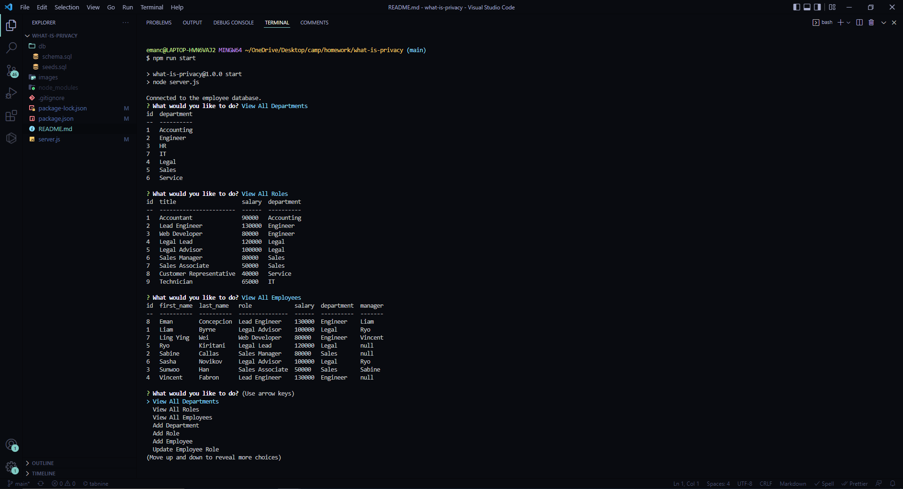

# WHAT-IS-PRIVACY

## Description

Employee Management System an efficient way to access the employee database to quickly see information on employee names, titles, salary, managers, and departments. The system also allows you to add departments, roles, and employees.

## User Guide

User will need to fork or clone this repository to use. User will also need mysql workbench to seed the data. User will need to npm i in order to use inquirer, mysql2, and console.table

## Screenshots

## Live Demo

* https://drive.google.com/file/d/1WBKU_6Mi966OwQiGFFqiY7fiIu0vauKp/view
